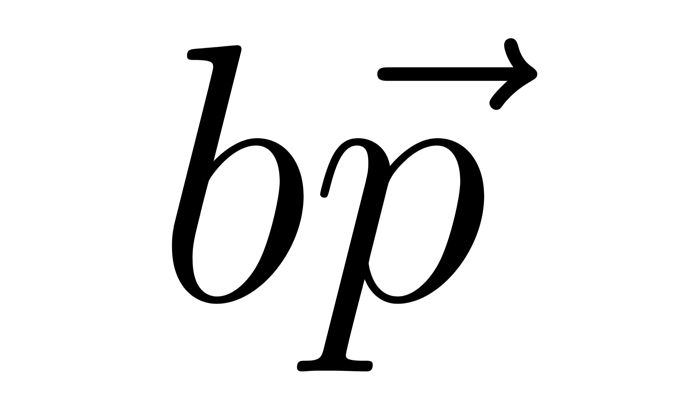

<h1 align="center">BasePhysics</h1>

BasePhysics - a simple 2D physics engine written in C++17 for educational purposes.

---

## Project Overview
BasePhysics is a personal learning project created to explore the fundamentals of 2D rigid body dynamics. My goal is to understand the math and logic behind physics simulation from the ground up.

Even though this engine might not reach the perfection or feature-set of industry-standard tools, I am committed to making it as stable and polished as possible.

One of my priorities is to provide a **clean and transparent API**, ensuring that the engine is not only a learning tool for me but also easy to understand and use for anyone interested in small 2D prototypes.

### Features
*   **Simple Rigid Body Dynamics**: Basic linear and angular motion with damping.
*   **SAT-based Collisions**: Detection for Circles, Boxes, and Convex Polygons using the Separating Axis Theorem.
*   **Impulse Solver**: A basic implementation of collision response with friction and restitution.
*   **Substepping**: Support for dividing the time step into smaller increments to help with simulation stability.
*   **Geometry Caching**: A simple optimization that transforms vertices and normals once per step to maintain efficiency.

### Future Goals
I plan to continuously expand this engine as I learn more advanced concepts. My roadmap includes:
*   **Broad-phase Optimizations**: Implementing Spatial Hashing to handle hundreds of objects.
*   **Improved Stability**: Refining stacking and contact point generation (for example Sutherland-Hodgman clipping).
*   **Fluid Simulation**: Implementing particle-based or grid-based fluids to simulate liquids and gases.
*   **Softbody Physics**: Exploring spring-mass systems or PBD (Position Based Dynamics) for deformable objects.

### Tech Stack
*   **Language**: C++17
*   **Demo & Visualization**: SFML 2.6.2
*   **GUI**: Dear ImGui
*   **Build System**: CMake

### Disclaimer
This engine is a work-in-progress and reflects my current stage of learning. It might have bugs, jittery behavior in complex scenarios, or unoptimized code paths. It is not designed for large-scale or production-level games, but it serves as a functional foundation for small projects and a deep dive into 2D physics.